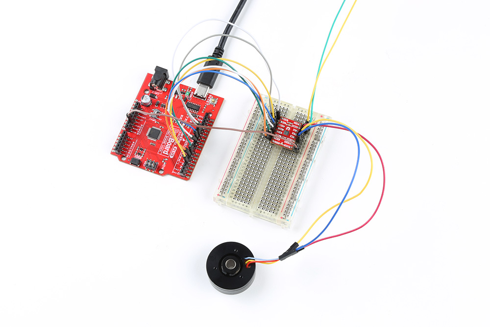

## Hardware Assembly

Users should already have followed the instructions from the [component assembly](../../component_assembly) and [example setups](../../hardware_assembly) sections to setup their hardware for this example.

<figure markdown>
[{ width="200" }](../img/hookup_guide/example-BLDC_motor.jpg "Click to enlarge")
<figcaption markdown>
A graphical representation of the connections between the [RedBoard Plus](https://www.sparkfun.com/products/18158) and a [breadboard](https://www.sparkfun.com/products/12002) with the [TMC6300 motor driver](https://www.sparkfun.com/products/21867) attached.
</figcaption>
</figure>


### RedBoard Plus to TMC6300

Connect the following pins from the RedBoard Plus to the TMC6300.

--8<-- "./docs/hardware_assembly.md:12:26"

### Connecting the Gimbal Motor

--8<-- "./docs/hardware_assembly.md:45:52"

### Powering the TMC6300

If users are unable to find a suitable power source, we have found that the 5V power output from the RedBoard Plus is sufficient to drive the gimbal motor, under a no load condition at low speeds.

--8<-- "./docs/hardware_assembly.md:83:97"


## Example Code

After installing and setting up the Arduino IDE and the Simple FOC Arduino library, users will need to upload the following example code to the RedBoard Plus. This code can be copied or downloaded below:

<center>
[:octicons-download-16:{ .heart } Download `BLDC.ino` Example Code](../BLDC/BLDC.ino){ .md-button .md-button--primary }
</center>

!!! code "Example Code"
    ``` c++ title="BLDC.ino"
        --8<-- "./docs/arduino_examples/BLDC/BLDC.ino"
    ```

### Running the Motor

Be default, the motor should spin automatically. However, if users wish to control the speed of the motor, they can uncomment lines **21-22** and **56-57** of code and reprogram the RedBoard Plus.

??? code "Code Changes Highlighted"
    Uncomment the following lines of code (**21-22** and **56-57**):

    ``` c++ hl_lines="21-22 56-57" title="BLDC.ino"
        --8<-- "./docs/arduino_examples/BLDC/BLDC.ino"
    ```

In order to drive the motor, users will need to access the [serial monitor](https://learn.sparkfun.com/tutorials/8) and provide the [commands](https://docs.simplefoc.com/commands_source) necessary to drive the motor. A full list of the available commands can be found in the [Simple FOC Arduino library documentation](https://docs.simplefoc.com/commands_source). However, only the `T` and `L` commands are enabled in the example code.

* Sending a `T` command will set the target motor velocity in rads/s
    * Example - Entering `T6` into the serial monitor, will set the target motor velocity to 6 radians/s.
* Sending a `L` command will set the voltage limit of the motor driver and in turn, the current limit *(voltage_limit / motor_resistance)*
    * Example - Entering `L5` into the serial monitor, will set the voltage limit to 5V and the current limit to .5A *(5V/10&ohm;)*.

!!! tip "Baud Rate"
    THe serial monitor baud rate should be configured to 115200bps.